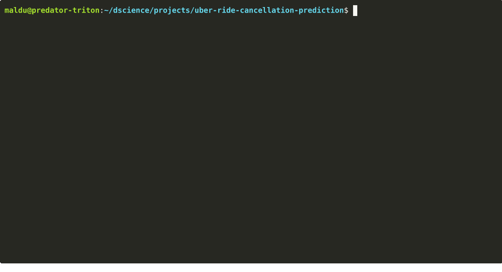

# Uber Ride Cancellation Analysis

Welcome to my data analysis project on 150,000 Uber bookings from 2024. The goal is to understand why 32% of rides get cancelled, that is 960K dollars/year in lost revenue and ship the findings as a BI Superset dashboard

**This repo contains the data pipeline + dashboard. The END-TO-END problem framing lives here: [CASE STUDY](./CASE_STUDY.md)** 
A CRISP-DM including decisions & logic on business framing, cost-based metric design, EDA findings, modelling, tuning, evaluation, deployment and monitoring



## Run my project

On the terminal:

```bash
# Install the virtual env & dependencies
python -m venv .venv
pip install -r requirements.txt

# First-time Superset boot
docker compose up -d

# Run the pipeline & start the dashboard
python run_analysis.py
```
Default credentials are created on first boot:
- user: admin
- password: admin
  
Every value in the dashboard is computed from the dataset produced in the enrich step, nothing is hardcoded

```
raw CSV --> clean --> enrich --> Superset Dashboard
```

## Key Findings on EDA

- **32% of bookings end in cancellation.** That is 960K dollars estimated annual loss
- **Avg Time of Arrival (avg_vtat) is the dominant predictor** with clear behavioural zones between 2 and 20 minutes
- **avg_vtat > 15 min has 100% cancellation rate** 
- **avg_vtat <= 2.9 min has 0% cancellation rate** 
- **avg_vtat missing has 100% cancellation rate** 
- **Missingness on avg_vtat is MNAR** and driven by the target itself, so it is kept as a feature 
- **Temporal features carry no signal** cancellation rates on date, hour and the derivates I created weekday, month, is_weekend and quarter are all flat, only the ride volume has a morning and an evening peak
- **Vehicle type is not discriminative**: all 7 types are around the 32% mean including when crossed against other features like pickup and drop locations or avg_vtat
- **pickup_location and drop_location are noise** have no signal either and create noise with their unique 176 categories each
- route (pickup x drop) showed signal first but discarded after failing CV due to its even higher cardinality
- **booking_id and customer_id we flagged as a data quality issue** because they contained duplicates. Dropped anyways

## What I Learned

- Framing the project from a Business Perspective before ML following CRISP-DM framing in [Case Study](./CASE_STUDY.md) (cost matrix, EV thresholds, capacity cap, acceptance criterias) 
- Deterministic rules can help a lot. EDA showed different heuristic rules cover  around 14% of rides with a 100% of accuracy and consequently pushed me toward a heuristic + ML hybrid in the modelling plan
- Apache Superset is an awesome Power BI / Tableau alternative. None of them run natively on Linux and Apache Superset has an easy UI and runs on Dockerized environment


## Tech Stack

- python 3.10+ 
- SQL
- pandas, NumPy, PyArrow (Parquet), SciPy, statsmodels, scikit-learn, matplotlib, seaborn, plotly
- Notebooks run on jupyter & pipeline on python scripts
- Apache Superset (BI Dashboard) + Docker


