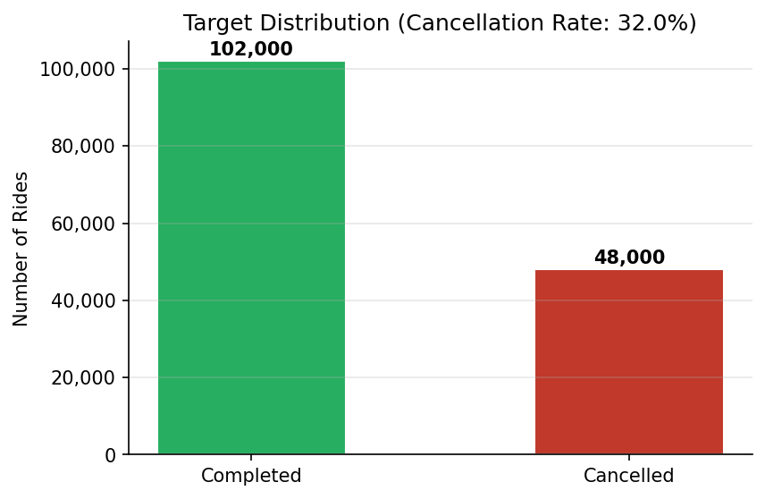
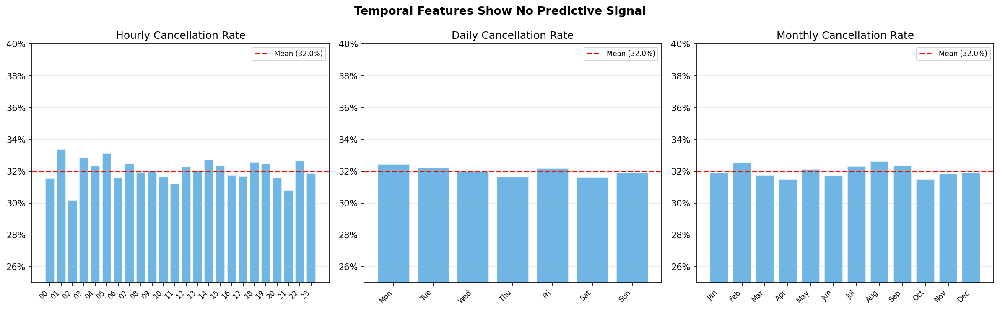
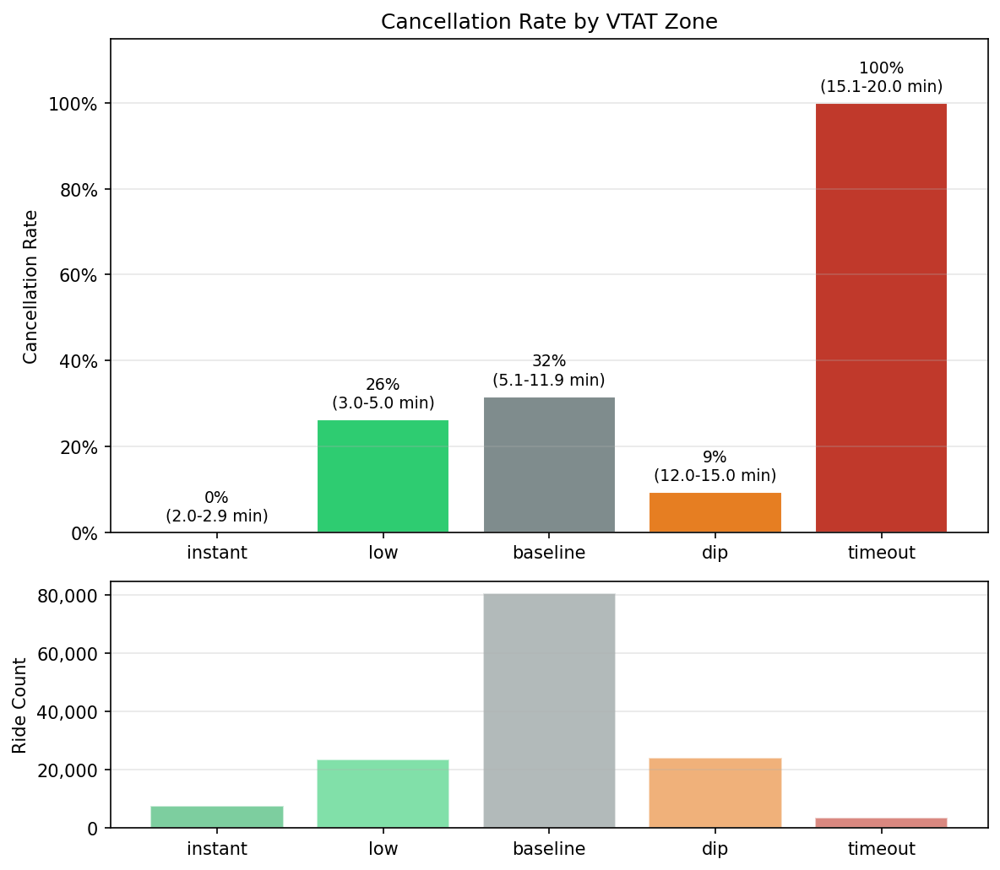
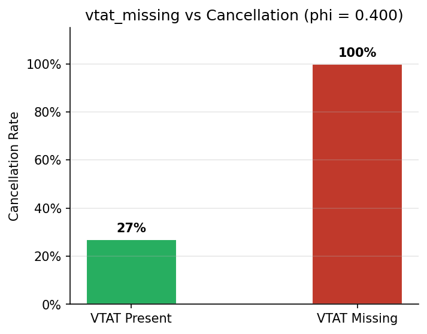
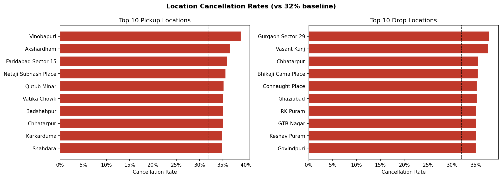
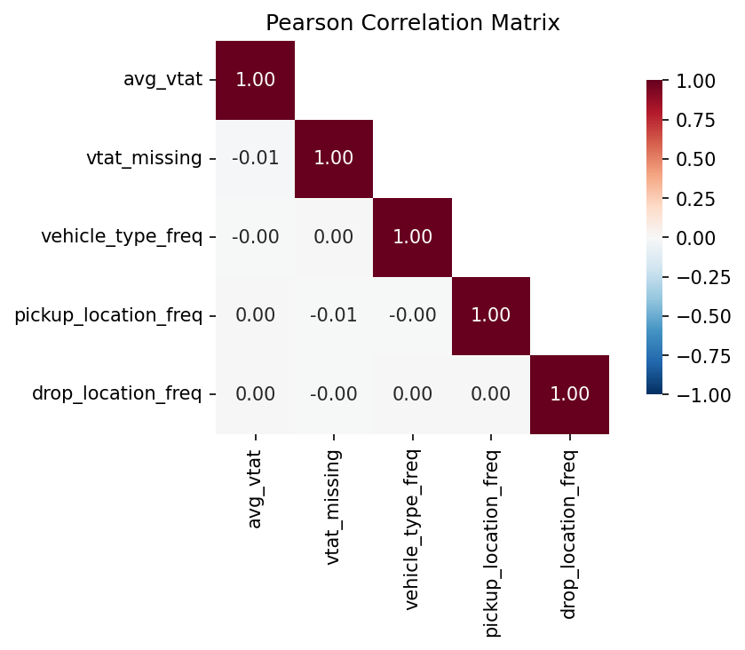

# Uber Ride Cancellation Analysis Report

*Generated: 2026-04-15 11:23:48*

## 1. Dataset Overview

| Property | Value |
|----------|-------|
| Total records | 150,000 |
| Features | 7 |
| Vehicle types | 7 |
| Unique pickup locations | 176 |
| Unique drop locations | 176 |
| VTAT coverage | 93.0% (10500 missing) |

## 2. Target Distribution and Business Impact

- **32.0%** of all bookings end in cancellation (48,000 out of 150,000)
- Estimated annual revenue loss: **~$960,000** (at $20 avg booking value)
- Class ratio: 68% completed / 32% cancelled (moderately imbalanced)

## 3. Univariate Highlights

### VTAT (Vehicle Time to Arrival)

The **strongest signal** in the dataset. Range: 2.0 - 20.0 min, mean: 8.5 min, median: 8.3 min. 10500 rows (7.0%) have missing VTAT values -- all of which are cancellations (see bivariate section).

### Temporal Features

Cancellation rate is **flat** across all time dimensions:
- Hourly spread: 3.2pp
- Daily spread: 0.8pp
- Monthly spread: 1.1pp

No temporal features carry predictive signal.

### Vehicle Type

7 categories, all showing ~32% cancellation rate. Not a discriminative feature.

## 4. Bivariate Highlights

### VTAT Zones: The Dominant Predictor

VTAT shows a non-linear, non-monotonic relationship with cancellation, captured by five behavioural zones:

| Zone | VTAT Range | Cancel Rate | n |
|------|------------|-------------|---|

| Instant | 2.0-2.9 min | 0.0% | 7,693 |

| Low | 3.0-5.0 min | 26.3% | 23,618 |

| Baseline | 5.1-11.9 min | 31.6% | 80,580 |

| Dip | 12.0-15.0 min | 9.4% | 24,088 |

| Timeout | 15.1-20.0 min | 100.0% | 3,521 |

**Key insight**: VTAT >= 15.1 min -> 100% cancellation rate (system auto-cancellation). The 12-15 min 'dip' suggests a sunk-cost effect where riders who have already waited are less likely to cancel.

### vtat_missing: A Strong Binary Signal

Every row with missing avg_vtat is cancelled (phi = 0.400, OR = inf). These represent early cancellations before vehicle assignment -- 100% precision but only ~22% of all cancellations.

### Location Patterns

- Pickup location Cramer's V: 0.0369 (faint)
- Drop location Cramer's V: 0.0367 (faint)
- Top locations show ~35-39% cancellation vs 32% baseline (~7pp swing)

## 5. Multivariate Highlights

### Missingness Confounding Check

Tested whether non-VTAT features predict vtat missingness beyond is_cancelled alone. AUC lift: **0.0019** -- missingness is purely target-driven with no hidden confounding.

### Feature Redundancy

- avg_vtat vs vtat_zone: eta-squared = 0.8239 (high overlap by design)
- vtat_zone vs vtat_missing: Cramer's V = 1.0000

### Route Feature Validation

Combined pickup x drop creates 30,564 unique routes. Cross-validated target encoding at all smoothing levels (m=5, 20, 50) produced **zero lift** -- the apparent high Cramer's V is entirely a cardinality artifact. Route should be dropped.

### Correlation Structure

All VIFs are near 1 (max: 1.00) -- no multicollinearity. The feature space is relatively orthogonal.

## 6. Statistical Tests Summary

| Test | Method | Statistic | p-value | Interpretation |
|------|--------|-----------|---------|----------------|
| Hour vs Cancellation | Chi-square | V = 0.0123 | p = 4.88e-01 | Negligible |
| Weekday vs Cancellation | Chi-square | V = 0.0059 | p = 5.08e-01 | Negligible |
| Month vs Cancellation | Chi-square | V = 0.0078 | p = 6.17e-01 | Negligible |
| Daily Rate Trend | Spearman | rho = 0.0018 | p = 9.73e-01 | No trend |
| Vehicle Type vs Cancellation | Chi-square / Cramer's V | V = 0.0061 | - | Negligible |
| Pickup Location vs Cancellation | Cramer's V | V = 0.0369 | - | Faint signal |
| Drop Location vs Cancellation | Cramer's V | V = 0.0367 | - | Faint signal |
| avg_vtat vs Cancellation | Spearman | rho = 0.0474 | p = 3.54e-70 | Dominant predictor |
| vtat_missing vs Cancellation | Fisher / Phi | phi = 0.400, OR = inf | p = 0.00e+00 | Strong signal |
| Missingness Confounding | Logistic Reg AUC lift | delta = 0.0019 | - | No confounding |
| Route (smoothing=5) | CV AUC lift | lift = -0.0094 | - | No generalisable signal |
| Route (smoothing=20) | CV AUC lift | lift = -0.0225 | - | No generalisable signal |
| Route (smoothing=50) | CV AUC lift | lift = -0.0006 | - | No generalisable signal |

## 7. Business Recommendations

Based on the analysis findings:

1. **VTAT is the actionable lever**: Rides with VTAT >= 15 min are auto-cancelled. Reducing vehicle assignment time directly reduces cancellations.

2. **Early cancellation detection**: Missing VTAT (no vehicle assigned yet) perfectly predicts a subset of cancellations. Proactive engagement at booking time could retain some of these riders.

3. **The 12-15 min dip is exploitable**: Riders who have waited 12+ minutes show lower cancellation rates (sunk-cost effect). ETA communication and incentives in the 5-12 min window could push more riders into this retention zone.

4. **Temporal and vehicle-type interventions are unlikely to help**: Cancellation rate is flat across hours, days, months, and vehicle types. Time-based or vehicle-based strategies would not target the problem.

5. **Location-based strategies have limited upside**: A ~7pp rate swing between the best and worst locations suggests some geographic signal, but the effect size is small. Location-specific interventions are a secondary priority.
